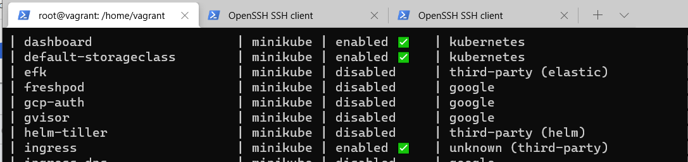
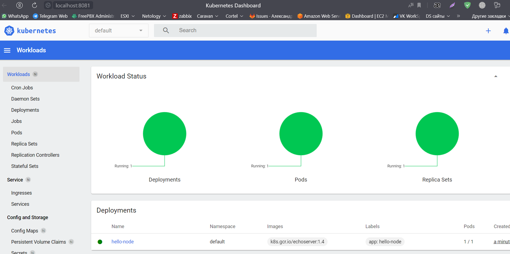
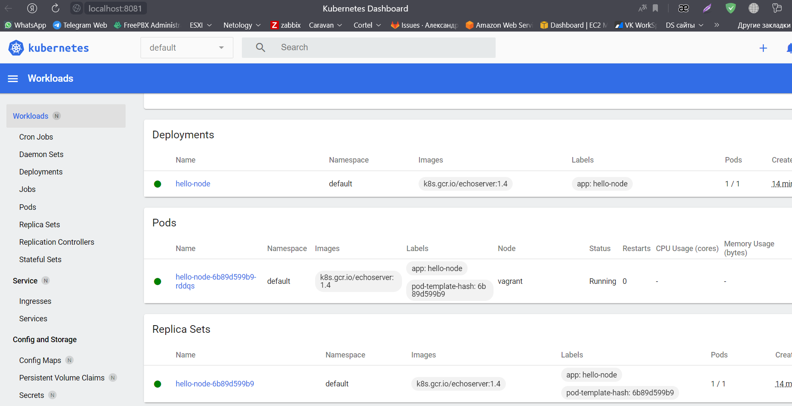
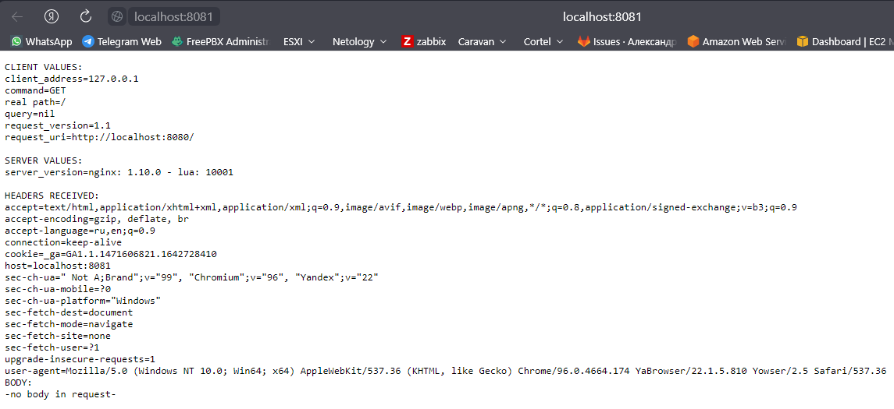

## Домашнее задание к занятию "12.1 Компоненты Kubernetes"

### Задача 1: Установить Minikube

#### после запуска стоит проверить статус: minikube status

    root@vagrant:/home/vagrant# minikube status
    minikube
    type: Control Plane
    host: Running
    kubelet: Running
    apiserver: Running
    kubeconfig: Configured

#### запущенные служебные компоненты можно увидеть командой: kubectl get pods --namespace=kube-system

    root@vagrant:/home/vagrant# kubectl get pods --namespace=kube-system
    NAME                              READY   STATUS    RESTARTS      AGE
    coredns-64897985d-kjzpk           1/1     Running   2 (91m ago)   108m
    etcd-vagrant                      1/1     Running   2 (91m ago)   108m
    kube-apiserver-vagrant            1/1     Running   2 (91m ago)   108m
    kube-controller-manager-vagrant   1/1     Running   2 (91m ago)   108m
    kube-proxy-ffcqk                  1/1     Running   2 (91m ago)   108m
    kube-scheduler-vagrant            1/1     Running   2 (91m ago)   108m
    storage-provisioner               1/1     Running   4 (81m ago)   108m

### Задача 2: Запуск Hello World

После установки Minikube требуется его проверить. Для этого подойдет стандартное приложение hello world. А для доступа к нему потребуется ingress.

развернуть через Minikube тестовое приложение по туториалу
установить аддоны ingress и dashboard
Добавляем аддон minikube addons ingress

Заворачиваем трафик до дашборда kubectl proxy --port=8081 --address=0.0.0.0

### Задача 3: Установить kubectl
Подготовить рабочую машину для управления корпоративным кластером. Установить клиентское приложение kubectl.

    root@vagrant:/home/vagrant/gitwork/devkub-homeworks-my/12-kubernetes-01-intro/minikube# kubectl get services
    NAME         TYPE           CLUSTER-IP       EXTERNAL-IP   PORT(S)          AGE
    hello-node   LoadBalancer   10.109.115.225   <pending>     8080:31440/TCP   2s
    kubernetes   ClusterIP      10.96.0.1        <none>        443/TCP          22h

подключиться к minikube
проверить работу приложения из задания 2, запустив port-forward до кластера

    root@vagrant:/home/vagrant# kubectl port-forward hello-node-6b89d599b9-rddqs 8081:8080 --address=0.0.0.0
    Forwarding from 0.0.0.0:8081 -> 8080

